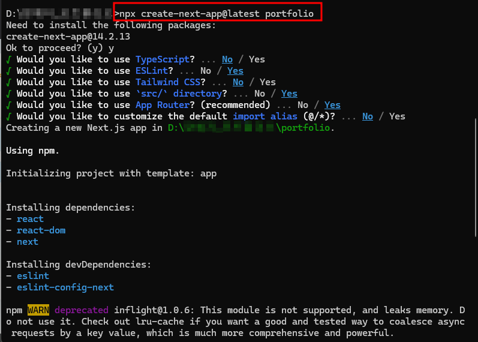
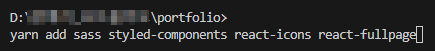

# 양예지 이력서 & 웹 포트폴리오


## 💻초기설정

Next.js 프레임워크를 사용해 새 프로젝트를 생성하고, TypeScript, ESLint, Tailwind CSS 등의 설정을 추가하는 초기 설정



.prettierrc
```yml
{
    "singleQuote": true,
    "semi": true,
    "useTabs": false,
    "tabWidth": 2,
    "trailingComma": "all"
}
```

- 의존성 설치
    - react-fullpage
    - sass
    - styled-components
    - react-icons



📌 yarn dev 명령어로 포트폴리오 프로젝트의 로컬 개발 서버를 실행하여 브라우저에서 결과를 확인할 수 있다.

---

- react-fullpage 라이브러리

하나의 페이지로 섹션별로 항목 구성

기본 구조
```js
import React from 'react';
import {SectionsContainer, Section} from 'react-fullpage';
 
let options = {
  ...
};
 
// => in the render() method of your app
return (
  <SectionsContainer {...options}>
    <Section>Page 1</Section>
    <Section>Page 2</Section>
    <Section>Page 3</Section>
  </SectionsContainer>
);
```

## 기초 작업
### 컴포넌트 분리, 리팩토링
- 각 항목별로 컴포넌트 분리해서 페이지 구성, 메인 컨테이너에 각 컴포넌트 전달
- 코드의 가독성과 유지보수성을 위해 MainContainer 내부의 각 섹션을 독립적인 컴포넌트(TopMenu, InfoAbout, Experience, Portfolio)로 분리함

```js
'use client';
import React from 'react';
import { SectionsContainer } from 'react-fullpage';
import TopMenu from '../components/TopMenu';
import InfoAbout from '../components/InfoAbout';
import Experience from '../components/Experience';
import Portfolio from '../components/Portfolio';

const options = {
  anchors: ['sectionOne', 'sectionTwo', 'sectionThree'],
};

const MainContainer = () => {
  return (
    <>
      <TopMenu />
      <SectionsContainer {...options}>
        <InfoAbout />
        <Experience />
        <Portfolio />
      </SectionsContainer>
    </>
  );
};

export default React.memo(MainContainer);
```

.gif>)

## 상단 프로필 이미지
